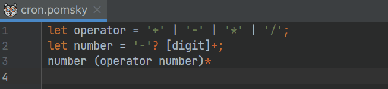

<!--suppress HtmlDeprecatedAttribute -->

# IDEA Pomsky

Provides support for [Pomsky][1] in IntelliJ IDEA-based IDEs.

## Status

The plugin is under active development, and a first minimal release is expected by the end of January 2023.

## Features

**Syntax highlight** and **navigation to variable** declaration.

**Variable rename**, both in-place and via dialog.

**Fragment injection** in comments and strings.

[1]: https://github.com/rulex-rs/pomsky
[2]: https://github.com/rulex-rs/pomsky/issues/42#issuecomment-1305237036
