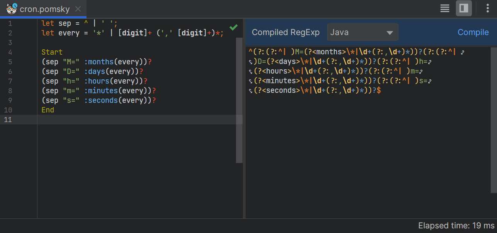
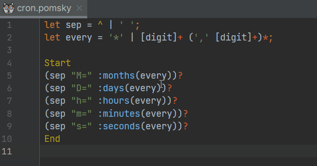
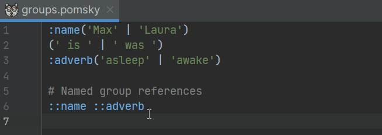
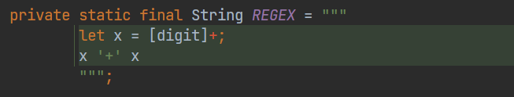

<!--suppress HtmlDeprecatedAttribute -->

# IDEA Pomsky

Provides support for [Pomsky][1] in IntelliJ IDEA-based IDEs.

Looking for the latest **plugin binary**? Get it [here][2]!  
Supported IDE versions **from 0.1.0**: `231.*` to `233.*` (both inclusive)

## Development status

The plugin offers good support for Pomsky, but isn't out of alpha-like quality for parsing yet.

## Supported features

#### In-editor compile and preview

#### Syntax highlight and navigation to variable declaration

#### Variable rename, both in-place and via dialog

#### Navigation to named group declaration and rename, both in-place and via dialog

#### Fragment injection in comments and strings

Other minor features include:

- Brace matching
- Automatic line commenting
- Spellchecking (where appropriate)

[1]: https://github.com/rulex-rs/pomsky
[2]: https://github.com/lppedd/idea-pomsky/releases
