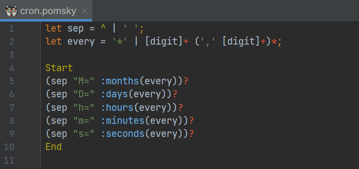

# IDEA Pomsky

Provides support for [Pomsky][1] in IntelliJ IDEA-based IDEs.

### Screenshots

An example of syntax highlight (taken [here][2]):

[1]: https://github.com/rulex-rs/pomsky
[2]: https://github.com/rulex-rs/pomsky/issues/42#issuecomment-1305237036
